# Dylan's Datadog Solutions

## Collecting Metrics
By adding a mix of one worded and key-value pair tags in the Agent config folder, I generated tags for the Datadog agent.

````
# Set the host's tags (optional)
tags: test, env:prod, role:database, stage:testing, role:admin, region:us-east, user:dylan
````
Below is a screenshot of the Host Map with the above tags in effect.
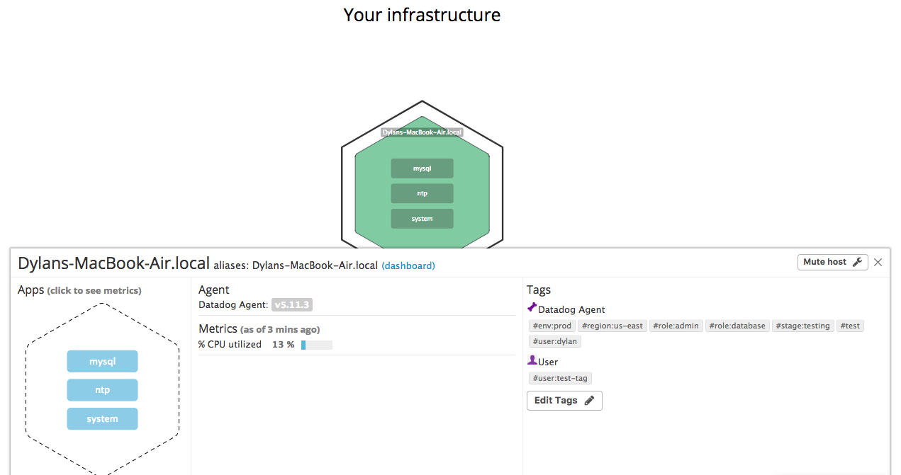

A screenshot of Datadog's MySQL integration below:

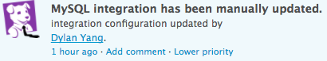

I created a custom Agent check by first creating a ````my_metric.py```` file in the ````/.datadog-agent/checks.d```` directory and a ````my_metric.yaml```` file in the ````/.datadog-agent/conf.d```` directory.

Within the ````my_metric.py```` file, I sent a metric to the DD agent with a random value between 0 and 1000:

````python
from checks import AgentCheck
from random import randint

class MyMetric(AgentCheck):
  def check(self, instance):
    self.gauge('my_metric', randint(0, 1000))
````

Under the ````my_metric.yaml```` file I set the collection interval to a minimum of 45 seconds:
````yaml
init_config:
  min_collection_interval: 45

instances:
  [{}]
````
Screenshot of the custom Agent check's timeline:
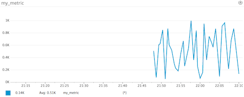

### Documentation and References
* [Writing a Custom Agent Check](https://blog.devopscomplete.com/writing-a-custom-datadog-agent-check-7367c98ffc5a)

## Visualizing Data
Using the Datadog API, I created a timeboard titled MyMetric Timeboard (referencing the previous custom agent check). There are 4 timeseries graphs that were created:
  1. My_Metric Over Time - the custom metric scoped over my host
  2. MySQL Anomalies - anomalies of connections in MySQL
  3. My_Metric Past Hour Rollup - the custom metric with the rollup function, summing all points for the past hour
  4. My_Metric Rollup and MySQL Connection Anomalies - aggregate of the My_Metric Rollup and MySQL Anomalies graphs

Please refer to ````create_timeboard.rb```` in the root directory of this repo for the [code](./create_timeboard.rb). Below is the screenshot of the graph:

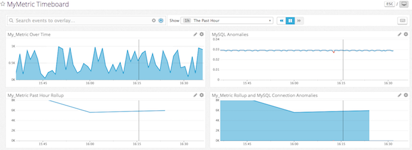

Use of the @mention function on a snapshot below:

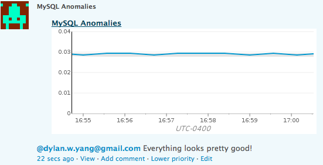

* The anomaly graph above is displaying what it believes is a normal trend. This is entirely based on the metric's past trends. If the current trend does not match what is typical, it will indicate to the user that there is an anomaly. This means that what a user may see as peaks and valleys in the graph may not exactly depict anomalies, as that could be typical pattern for the metric.

### Documentation and References
* [DD API Timeboards](https://docs.datadoghq.com/api/?lang=ruby#timeboards)
* [Rollup Function](https://docs.datadoghq.com/graphing/#aggregation-groups)

## Monitoring Data
Below are the emails received for my_metric's monitoring alerts:

* Alert

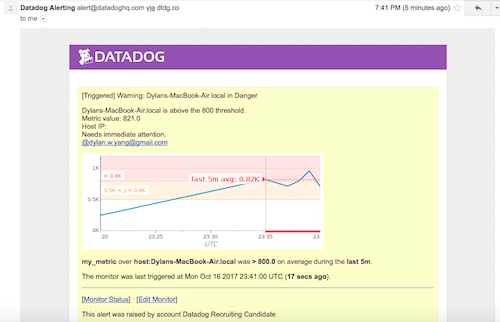

* Warning

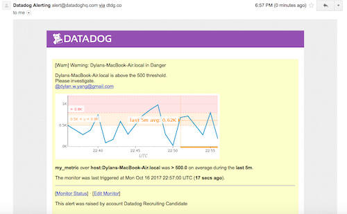

* No Data

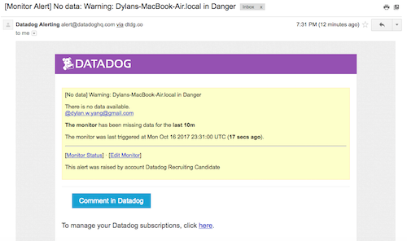

Below are screenshots of the scheduled downtimes:

* Weekdays 7pm - 9pm

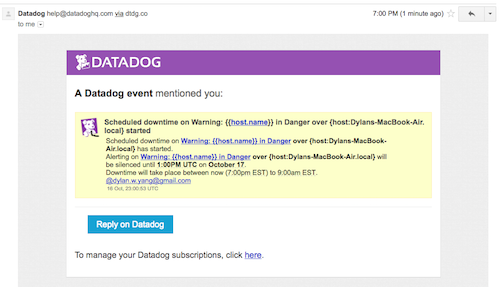

* Weekends (as I didn't want to wait until the weekend for an email, below is a screenshot of the scheduled downtime)

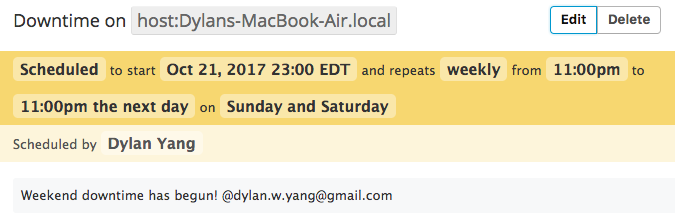

### Documentation and References
* [Monitoring Guide](https://docs.datadoghq.com/guides/monitors/#setup-notifications)

## Collecting APM Datadog
Using the given Flask app, I began tracing the app. Below is a screenshot of the dashboard created to represent the APM and infrastructure metrics. You can also view the screenboard [here](https://p.datadoghq.com/sb/235d07a23-65c05911f6).

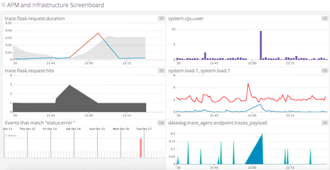

### Services vs Resources
Services are programs that perform an essential function in your web app. For example, in my host, I am using MySQL as a database service. Additionally, the Flask app is a service.

A resource is typically an object of your app that users can access using a URI. Using the previously given Flask app as an example, we defined several resources as seen here:
````python
@app.route('/api/apm')
def apm_endpoint():
  return 'Getting APM Started'

@app.route('/api/trace')
def trace_endpoint():
  return 'Posting Traces'
````
And as seen on my Datadog Traces page in the screenshot below, the above resources are listed out:
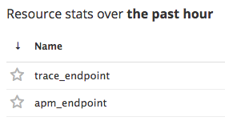

### Documentation and References
* [Resources vs Services](https://help.datadoghq.com/hc/en-us/articles/115000702546-What-is-the-Difference-Between-Type-Service-Resource-and-Name-)
